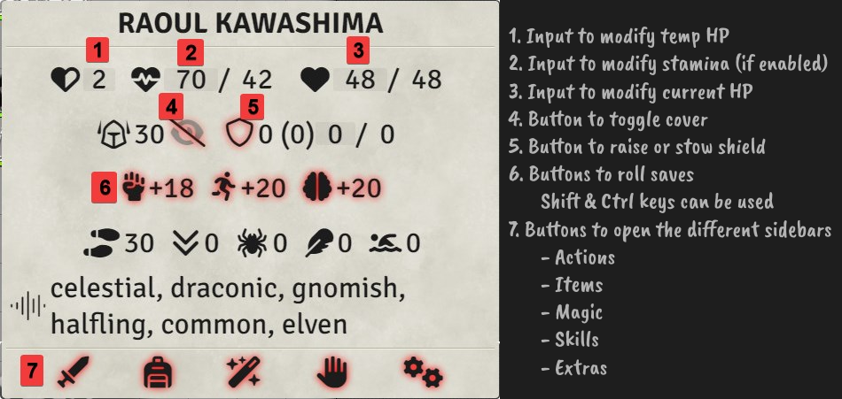

# FoundryVTT PF2e Token Hud

This module will generate an interactive token tooltip to access all the most used `Character` and `Npc` features.

### Readme will be done at a later time

# CHANGELOG

You can see the changelog [HERE](./CHANGELOG.md)
